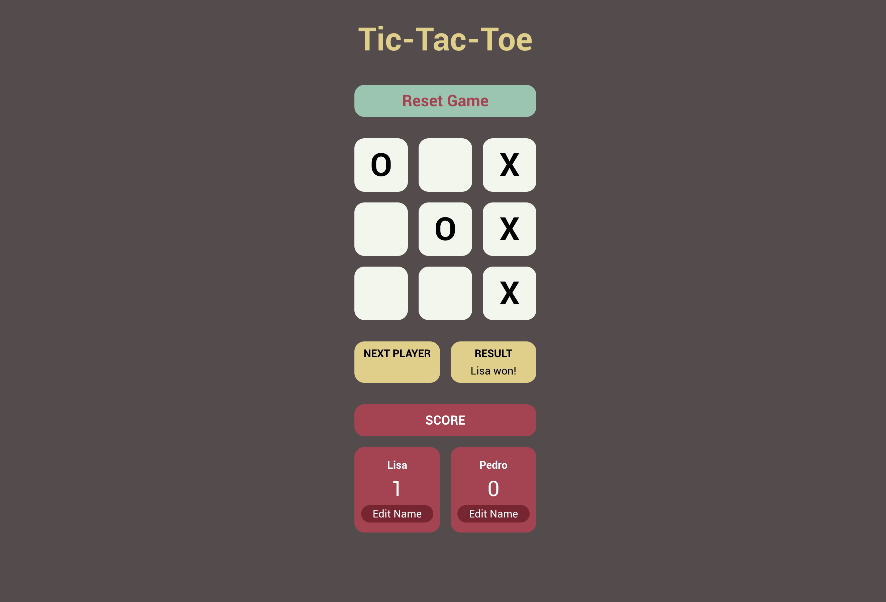

# Tic-Tac-Toe

This project is part of the [JavaScript course](https://www.theodinproject.com/paths/full-stack-javascript/courses/javascript) from [The Odin Project](https://www.theodinproject.com/). 

The objective is to implement the concepts of Immediately Invoked Function Expression (IIFE) and factory functions for separation of concerns and data integrity.

## Demo

[Try It Here](https://circobit.github.io/tic-tac-toe/)

## Screenshots

